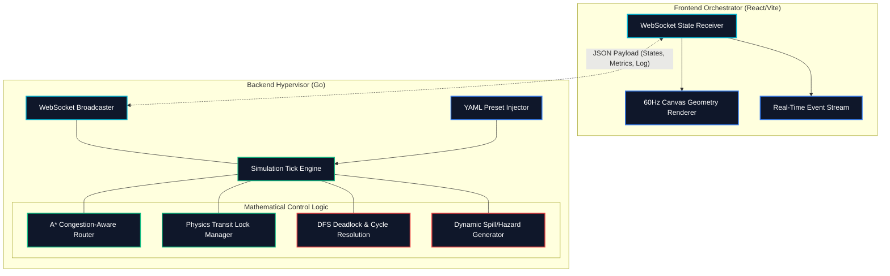

# GOAT Robotics: Autonomous Industrial Fleet Management System

GOAT Robotics is an enterprise-grade autonomous grid simulation and fleet management hypervisor. Engineered in Go and React, the platform orchestrates complex Swarm AI pathing, physics-compliant intersection constraints, and high-density industrial telemetry in real-time.

---

## System Architecture

The overarching architecture is bifurcated into a high-octane mathematical modeling backend and an aesthetic, high-framerate observability bridge.



---

## Core Technical Capabilities

The hypervisor deviates from basic line-following constraints, introducing fully organic and highly competitive multi-agent swarm environments.

### 1. Intelligent Neural Routing
A mathematically intensive **A* Pathfinding Algorithm** forces dispatch units to actively avoid heavily congested intersection lanes. The algorithm dynamically applies infinite-weight cost values to unpredictable toxic spills or blockades, forcing units to compute massive structural arcs around hazard zones. 

### 2. High-Priority Fleet Tiers (VIP Dispatch)
Instantiates complex hierarchical right-of-way routing. High-Priority elements inherently hold pathing locks longer, mathematically repelling standard Kiva units away from congested cores and ensuring rapid clearance for mission-critical objectives.

### 3. Cyclic Deadlock Annihilation
Unpredictable swarm collisions inherently formulate impossible looping gridlocks. The hypervisor continuously scans the wait-for maps utilizing iterative **Depth-First Search (DFS) topology tracking**. When a cycle is verified, the system systematically extracts the lowest-priority participant and mathematically ejects them entirely from the grid queue, evaporating traffic collapse instantly.

### 4. Physics-Compliant Transit Limits
Charging sectors and heavily trafficked hub terminals strictly enforce physics-based maximum occupation quotas. Unlike simplistic simulations, rendering overlap is fiercely rejected by the locking mechanisms, isolating the boundaries and queuing exterior traffic geometrically.

### 5. Lithium-Ion Energy Simulation
Finite energy tracking dictates dynamic swarm constraints. If a robotic construct breaches critical low-power thresholds, its priority logic overwrites objective goals and immediately targets the closest available charging hub. Total depletion events invoke physical immobility bounds, activating rescue towing protocols.

### 6. Sub-Millisecond PDF Telemetry
Captures highly dense enterprise datasets detailing throughput margins, lifecycle delays, active physical hazards, and hierarchical tier ratios, compiling them dynamically via vector graphic reporting (gofpdf).

---

## Repository Structure

```text
goat/
├── backend/
│   ├── main.go               # Entry point, WebSocket instantiator, Grid builder
│   ├── report_generator.go   # Sub-millisecond PDF vector-graphics reporting engine
│   ├── config.yaml           # Hot-swappable environment variables (preset definitions)
│   └── simulation/
│       ├── controller.go     # Physics Engine (A* Math, Deadlock Resolvers, Locks)
│       ├── graph.go          # Matrix routing definitions (Nodes, Lanes, Capacity)
│       └── robot.go          # Live memory structures for hardware tracking/battery
└── frontend/
    ├── index.html            # Core DOM structure and Terminal mounting points
    ├── main.js               # WebGL/Canvas rendering loop and WebSocket client
    ├── style.css             # Cyberpunk UI, layout containers, and styling logic
    └── package.json          # Node dependency configurations (Vite)
```

---

## Execution & Deployment Requirements

Execution requires robust hardware scaling and updated compilation environments.

* **Backend Engine**: Go 1.21+
* **Frontend UI**: Node.js 18+ (NPM, Vite)

### Activating the Core

1. Navigate to the execution environment.
2. Ensure WebSocket streaming is available on port `8080`.

```bash
cd backend
go run main.go report_generator.go
```

The system will initialize the grid mapping arrays and stand by for client-side mounting.

### Activating the Visor

1. Construct the DOM payload dependencies via NPM.
2. Initialize the hot-reload engine.

```bash
cd frontend
npm install
npm run dev
```

Intercept the localized port (typically `http://localhost:5173`) using a modern Chromium or WebKit browser. The connection will handshake and the autonomous swarm will execute immediately.

---

## Configuration Profiles

Standard profiles exist for various stress tests. The `Small` tier establishes basic logic validation across 8 units, while the `Large` tier heavily taxes algorithm resolution thresholds by saturating 25 units internally across a 10x6 matrix. Altering `backend/config.yaml` propagates changes atomically on refresh.
